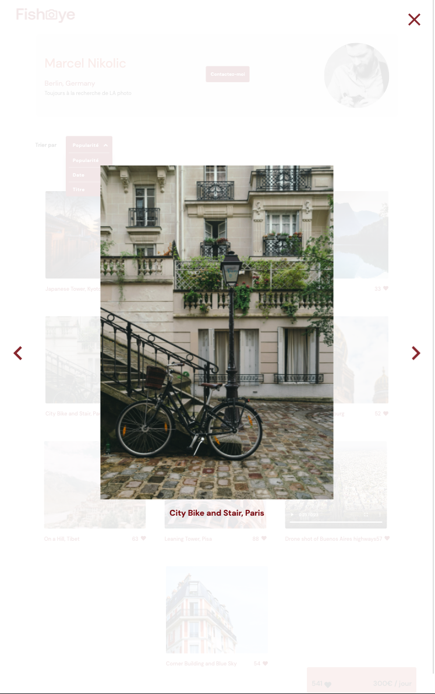

# Projet Fisheye - OpenClassrooms

Forker le repo et finir les 5 tâches suivantes : 

* Ajouter la fonction pour fermer la modale :negative_squared_cross_mark:
* Implémenter les entrées du formulaire :clipboard:
* Ajouter les messages d'erreurs ainsi que la validation en cliquant sur "Submit" :warning:
* Ajouter le message de confirmation lors de la soumission réussie du formulaire :incoming_envelope:
* Tests manuels des fonctionnalités :thumbsup: 

N'utiliser que du CSS personnalisé et du JavaScript pur, sans jQuery, Bootstrap ou autre librairie.

