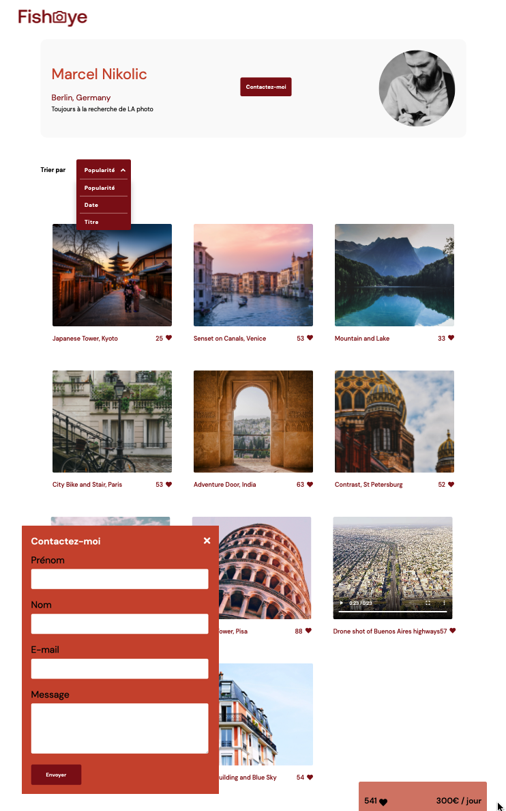

# Projet Fisheye - OpenClassrooms

### Objectif :  
Leur site est obsolète et a besoin d'être remanié.
"Notre site a été construit il y a plus de dix ans, et nous n'avons pas eu l'occasion de
le mettre à jour jusqu'à présent. Nous venons de lever des fonds et nous aimerions
que votre équipe le transforme d'un site statique à un site dynamique".    

### Prototype des fonctionnalités :  

Nous devons créer les pages suivantes pour le prototype :  

● Page d'accueil :  
&nbsp;&nbsp;○ Liste de tous les photographes avec leur nom, leur slogan, leur
localisation, leur prix/heure et une image miniature de leur choix.  
&nbsp;&nbsp;○ Lorsque l'utilisateur clique sur la vignette d'un photographe, il est
amené à sa page.    

● Page des photographes (le contenu de la page sera généré de manière
dynamique en fonction du photographe) :  
&nbsp;&nbsp;○ Affiche une galerie des travaux du photographe.  
&nbsp;&nbsp;○ Les photographes peuvent montrer à la fois des photos et des vidéos.  
&nbsp;&nbsp;&nbsp;&nbsp;■ Dans le cas des vidéos, montrer une image miniature dans la
galerie.  
&nbsp;&nbsp;○ Chaque média comprend un titre et un nombre de likes.  

&nbsp;&nbsp;&nbsp;&nbsp;■ Lorsque l'utilisateur clique sur l'icône "Like", le nombre de likes
affiché est incrémenté.  

&nbsp;&nbsp;&nbsp;&nbsp;■ Le nombre de likes total d’un photographe doit correspondre à la
somme des likes de chacun de ses médias.aw. 

&nbsp;&nbsp;○ Les médias peuvent être triés par popularité ou par titre.  
&nbsp;&nbsp;○ Lorsque l'utilisateur clique sur un média, celui-ci doit s’ouvrir dans une
lightbox :  
&nbsp;&nbsp;&nbsp;&nbsp;■ Lorsque la lightbox est affichée, il y a une croix dans le coin pour
fermer la fenêtre.  
&nbsp;&nbsp;&nbsp;&nbsp;■ Des boutons de navigation permettent de passer d'un élément
média à l'autre dans la lightbox (les utilisateurs peuvent cliquer
sur ces boutons pour naviguer).  
&nbsp;&nbsp;&nbsp;&nbsp;■ Les touches fléchées du clavier permettent également de
naviguer entre les médias dans la lightbox.  
&nbsp;&nbsp;○ Afficher un bouton pour contacter le photographe.  
&nbsp;&nbsp;&nbsp;&nbsp;■ Le formulaire de contact est une modale qui s'affiche par-dessus
le reste.  
&nbsp;&nbsp;&nbsp;&nbsp;■ Il comprend des champs pour les noms, l'adresse électronique et
le message.  
&nbsp;&nbsp;&nbsp;&nbsp;■ Plus tard, le bouton de contact enverra un message au
photographe. Pour l'instant, seulement afficher le contenu des
trois champs dans les logs de la console.  

N'utiliser que du CSS personnalisé et du JavaScript pur, sans jQuery, Bootstrap ou autre librairie.

